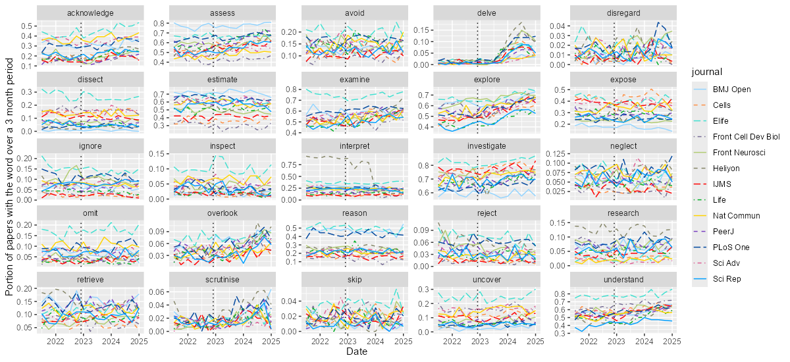
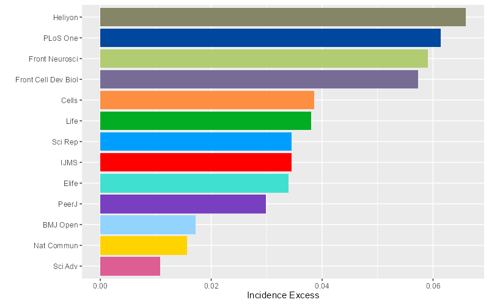
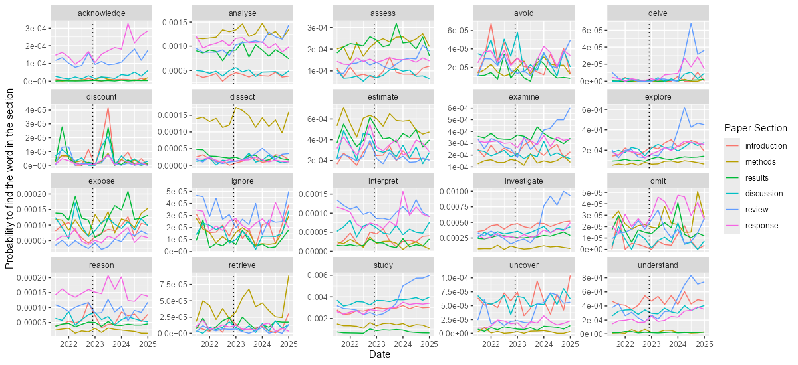
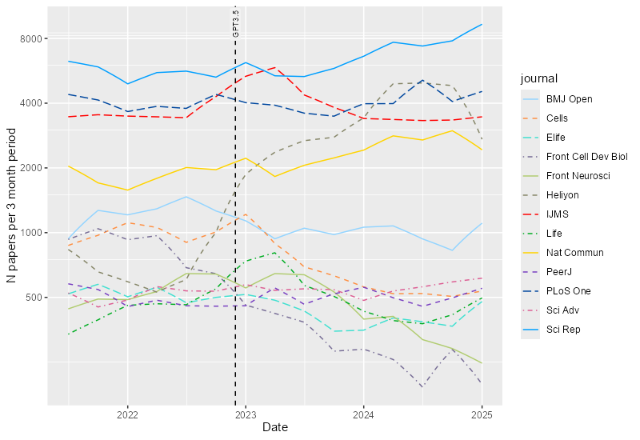

## The word "delve" in scientific papers
This repository contains a collection of scripts to reproduce the observed increase in the usage of the word "delve" in scientific literature (notably, Kobak et al. 2024). The presented data were collected by the "rentrez" R package from approximately 300 random papers per quarter per journal, with the last collection date at the end of 2024.

### The usage of the word "delve" in scientific papers
The usage of "delve" has risen sharply and unevenly across journals. The recent decline aligns with observations in arXiv papers (Geng & Trotta 2025).

Incidence (whether a paper has "delve"):


Delve counts per paper, normalised on the paper's length.


### Other similar words do not behave like this
Incidence


Normalised word count


### Ranking of tested journals by the "delving excess"
The ranking is not too surprising, though it is somewhat unexpected to see PLoS One on the same level as the Frontiers journals and Scientific Reports on the same level as the MDPI jornals.

Note: These rankings do not necessarily reflect the quality of a journal since the LLM usage could be a benign proofreading, among other things.

### Delving by paper section for Elife
[Elife journal](https://elifesciences.org/) employs a mandatory open-review model, allowing for a comparison of "delving" in reviews and authors' responses. Ironically, eLife's "delving excess" primarily originates from these sections.



### Supplementary: number of publish papers for the time period
The Helion's sudden growth of published papers is clearly seen and was supposedly one of the causes for WoS to pause it's indexing last year.


## References
Liang, Weixin, Yaohui Zhang, Zhengxuan Wu, Haley Lepp, Wenlong Ji, Xuandong Zhao, Hancheng Cao, et al. 2024.
“Mapping the Increasing Use of LLMs in Scientific Papers.”
arXiv. http://arxiv.org/abs/2404.01268.

Probably the most comprehensive study for the biomedical literature based on the content of PubMed abstracts:
Kobak, Dmitry, Rita González-Márquez, Emőke-Ágnes Horvát, and Jan Lause. 2024.
“Delving into ChatGPT Usage in Academic Writing through Excess Vocabulary.”
arXiv. http://arxiv.org/abs/2406.07016.

Recent paper on arXiv:
Geng, Mingmeng, and Roberto Trotta. 2025.
“Human-LLM Coevolution: Evidence from Academic Writing.”
arXiv. http://arxiv.org/abs/2502.09606.

Sytematic review:
Alchokr, Rand, Evelyn Starzew, Gunter Saake, Thomas Leich, and Jacob Krüger. 2024.
“The Impact of AI Language Models on Scientific Writing and Scientific Peer Reviews: A Systematic Literature Review.”
The 2024 ACM/IEEE Joint Conference on Digital Libraries (JCDL ’24), December 16 20, 2024, Hong Kong, China 1 (1).
https://doi.org/10.1145/3677389.3702508.

The abyss:
Liang, Weixin, Yuhui Zhang, Hancheng Cao, Binglu Wang, Daisy Ding, Xinyu Yang, Kailas Vodrahalli, et al. 2023.
“Can Large Language Models Provide Useful Feedback on Research Papers? A Large-Scale Empirical Analysis.”
arXiv. http://arxiv.org/abs/2310.01783.

## Usage
### Input files
- *dates.txt* — dates of the end of a quarter period used to fetch papers
- *journals-issn-codes.txt* — selected journals (mass open access journals indexed in the [PMC](https://pmc.ncbi.nlm.nih.gov/))
- *words.txt* — words to seek in the fetched content and their respective R regular expressions, aimed to capture all possible forms of the word (i.e. `(?i)delv(?:es|ed|e|ing)` for delve).
### Running the Code
In the R terminal:
```r
setwd("pubmed-delve") # set working directory with the repo
source("scripts/get-pmc-ids.R") # collects PMC ids for a given list of journals and dates
source("scripts/get-pmc-content.R") # fetches xml for a list of PMC ids and for each of them calculates incidence of a given word
source("scripts/aggregate-and-report.R") # aggregates the results and draw pictures
source("scripts/parsing-by-section.R") # additional script for the Elife's sections
```
Note that it might be necessary to run these commands on Linux machines to work with the xml2 package:
```sh
sudo apt update
sudo apt install -y libcurl4-openssl-dev libssl-dev libxml2-dev
sudo apt install -y libmysqlclient-dev libpq-dev
```
Tested for R v4.4.1 on Windows 11 and R v4.1.2 on Ubuntu 22.04.3
### Output files
- *pmc_ids.txt* — selected random PMC ids for given dates and journals
- *n_papers_per_quarter.txt* — amount of papers per period for a journal
- *data\fetched\raw_without_text* directory — word statistics for each paper
- *data\fetched\raw_with_text* directory — word statistics for each paper with the fetched xml content, **~7 Gb in total** (ignored)
- *data\parsing-by-section* directory — word statistics by a paper section (for Elife)

